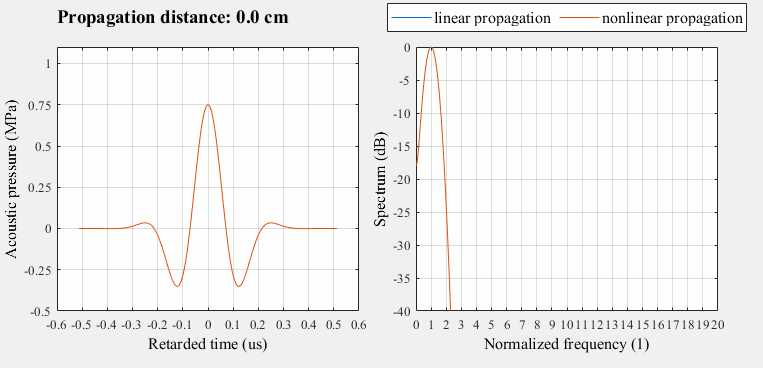

# Evaluation of an Analytical Volterra Series Solution to the Burgers Equation

![GitHub repo size][size-image]
![GitHub All Releases][downloads-image]

[size-image]: https://img.shields.io/github/repo-size/mschiffn/volterra_burgers
[downloads-image]: https://img.shields.io/github/downloads/mschiffn/volterra_burgers/total

Comparison of
a Volterra series solution to
the Burgers equation to
a fractional steps method.

## Background

The Burgers equation models
the nonlinear propagation of
plane ultrasonic waves in
homogeneous viscous fluids.

Its incorporation into
fast tissue harmonic imaging or
the detection of
ultrasound contrast agents potentially improves
these imaging modes.
Moreover,
the decompositions of
arbitrary types of
waves into
steered plane waves permit
the application of
this model
the Burgers equation to
other types of waves.

## Content

The script "eval_methods.m" compares
both methods by evaluating
various error metrics.
It additionally creates
a movie illustrating
the deformation of
the wave and
the accompanying generation of
harmonics.

The package +volterra contains
the functions for
the proposed Volterra polynomial, whereas
the package +fractional_steps contains
the functions for
the fractional steps reference method.

## Results

The following animation depicts
the result of
the 10th-degree Volterra polynomial.

## References :notebook:

The solution and exemplary images were published in:

1. M. Schiffner, M. Mleczko, and G. Schmitz, "Evaluation of an Analytical Solution to the Burgers Equation Based on Volterra Series", 2009 IEEE Int. Ultrasonics Symp. (IUS), pp. 573--576, 
2. M. Schiffner, M. Mleczko, and G. Schmitz, "Application of Volterra Series to Ultrasound Imaging", NAG/DAGA 2009 Int. Conf. Acoustics, Rotterdam, Mar. 2009, pp. 301--304
3. M. Schiffner, M. Mleczko, and G. Schmitz, "Application of Volterra Series to the Detection of Ultrasound Contrast Agents", World Congr. Medical Physics and Biomedical Engineering, Sep. 7--12, 2009, Munich, Germany. IFMBE Proceedings, vol. 25/2, pp. 478--481 
